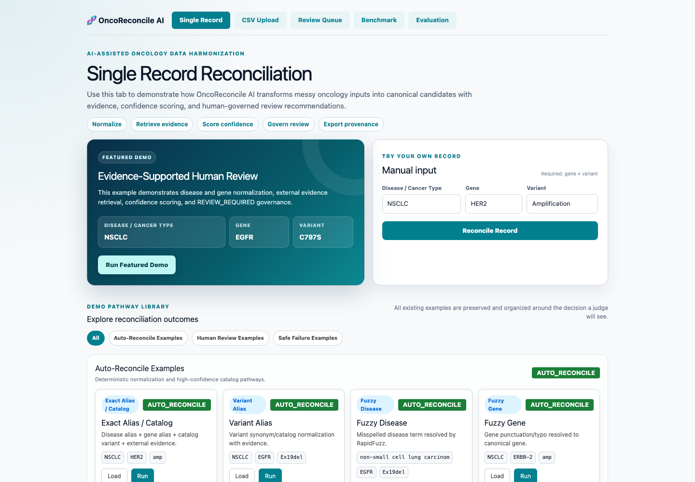
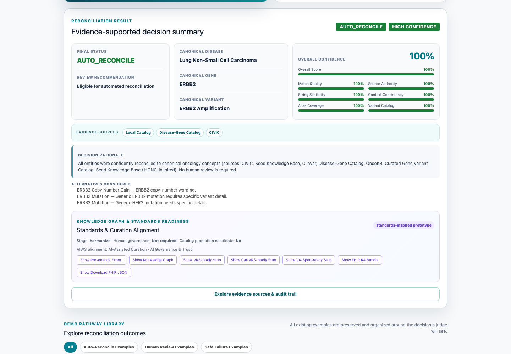
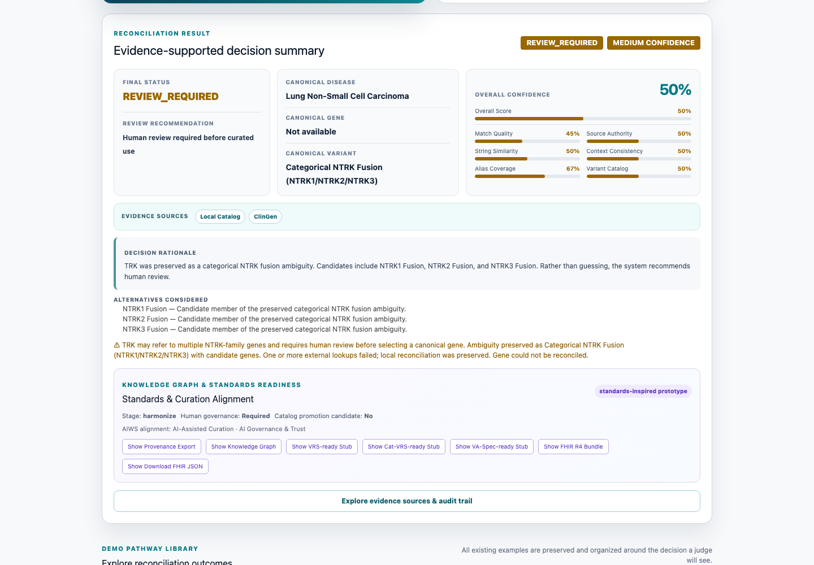
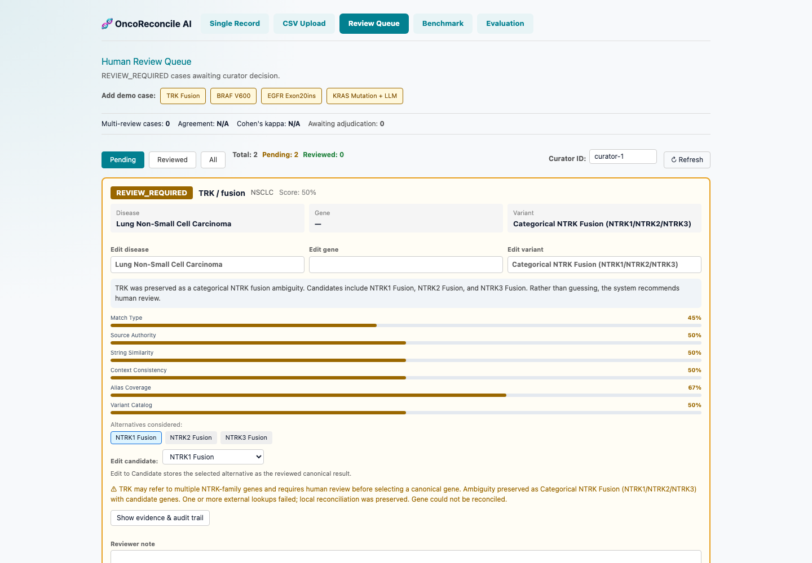
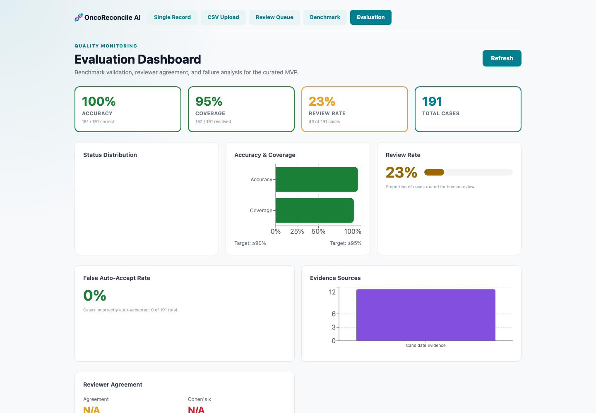
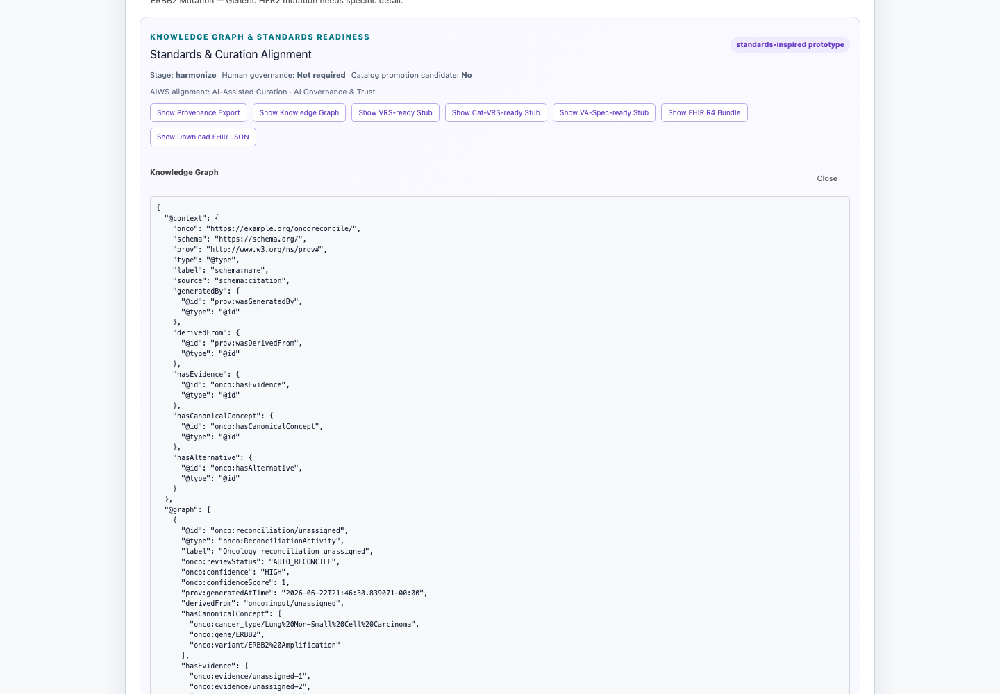
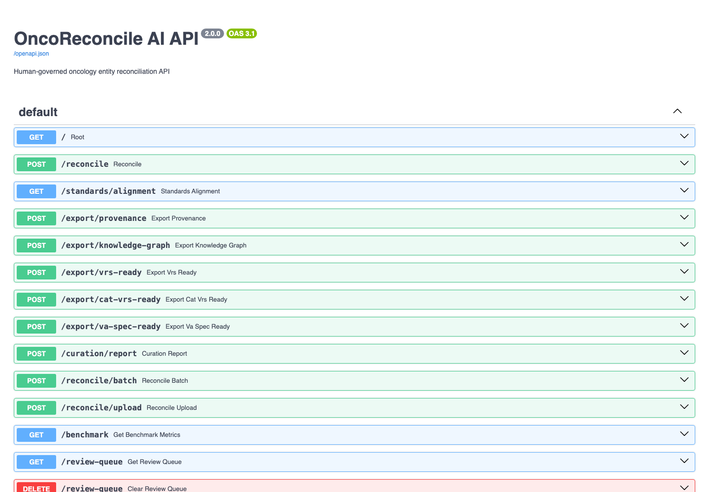

# OncoReconcile AI

## AI-Powered Precision Oncology Data Quality, Governance, Analytics & Interoperability Platform

OncoReconcile AI is an enterprise-grade platform that transforms fragmented oncology and clinical genomics data into trustworthy, explainable, and AI-ready information.

Built for the **DFWIT AI & Startup Competition 2026** by **Team Variant Vanguard**.

### Key Capabilities

* Disease Reconciliation
* Gene Reconciliation
* Variant Reconciliation
* Human-Governed AI
* Evidence Retrieval
* Patient Journey Analytics
* Precision Oncology Dashboards
* Evaluation & Benchmarking
* FHIR Export
* OMOP Export
* Knowledge Graph Generation
* Enterprise Governance Reporting

---

## Why This Matters

Precision oncology data is fragmented across:

* Electronic Health Records (EHR)
* Molecular Diagnostics
* Clinical Trials
* Research Databases
* Claims Systems
* Real-World Evidence Platforms

The same biological concept often appears under different names:

| Input   | Canonical                     |
| ------- | ----------------------------- |
| HER2    | ERBB2                         |
| HER1    | EGFR                          |
| p53     | TP53                          |
| NSCLC   | Lung Non-Small Cell Carcinoma |
| Ex19del | EGFR Exon 19 Deletion         |

Poorly harmonized data reduces interoperability, increases manual effort, and limits AI effectiveness.

OncoReconcile AI improves data quality before downstream analytics and AI workflows.

---

## Platform Modules

### Clinical Data Harmonization

* Single Reconciliation
* Batch Reconciliation
* Review Queue
* Reviewer Workspace

### Evidence Intelligence

* Evidence Explorer
* Evidence Packages
* External Knowledge Sources

### Precision Oncology Analytics

* Patient Journey Analytics
* Biomarker Analytics
* Cohort Analytics
* Disease Analytics

### Enterprise Governance

* Human Review Workflows
* Reviewer Metrics
* Governance Dashboard
* Audit Trails

### Interoperability

* FHIR Export
* OMOP Export
* Standards Alignment

### Knowledge Graph

* Disease-Gene-Variant Relationships
* Therapy Relationships
* Evidence Relationships

---

## Validation

| Metric               | Status      |
| -------------------- | ----------- |
| Backend Test Suite  | 102 Passing |
| Frontend Build       | Passing     |
| Benchmark Framework  | 500 Cases   |
| Evaluation Dashboard | Operational |
| Review Queue         | Operational |
| Evidence Package     | Operational |
| FHIR Export          | Operational |
| OMOP Export          | Operational |

---

## Benchmark Highlights

Current benchmark framework includes:

* 500 evaluation cases
* Alias normalization
* Ambiguous terminology
* Negative control testing
* Human governance validation

Latest benchmark results:

* Disease Accuracy: 68.6%
* Gene Accuracy: 96.6%
* Variant Accuracy: 94.6%
* Safety-Aware Status Accuracy: 89.8%
* False Auto-Accept Rate: 0%

---

## Screenshots

### Platform Homepage

### Single Record Reconciliation

### Review-Required Decision

### Human Review Queue

### Evaluation Dashboard

### Knowledge Graph Export

### Interactive API Documentation

---

## Architecture

Raw Oncology Data

↓

Entity Resolution

↓

Evidence Retrieval

↓

Confidence Scoring

↓

Governance Engine

↓

Human Review

↓

FHIR / OMOP Export

↓

Analytics & AI Applications

---

## Startup Vision

Our long-term vision is to become the biomedical data quality and interoperability layer for precision oncology.

Future directions include:

* Multi-cancer support
* Enterprise APIs
* Biomedical Knowledge Graphs
* AI-Assisted Curation
* Clinical Trial Harmonization
* Precision Oncology Intelligence Platforms

---

## Repository

Startup Platform Branch

https://github.com/oncoreconcile-ai/oncoreconcile-ai/tree/startup-platform

---

## Documentation

* docs/DFWIT_Checkpoint2_Primary_Submission.md
* docs/startup_platform_overview.md
* docs/commercial_strategy.md
* docs/roadmap.md
* docs/architecture.md

---

## Disclaimer

OncoReconcile AI is a biomedical data harmonization and governance platform.

It is not a clinical decision support system and does not provide diagnosis, treatment recommendations, or medical advice.
