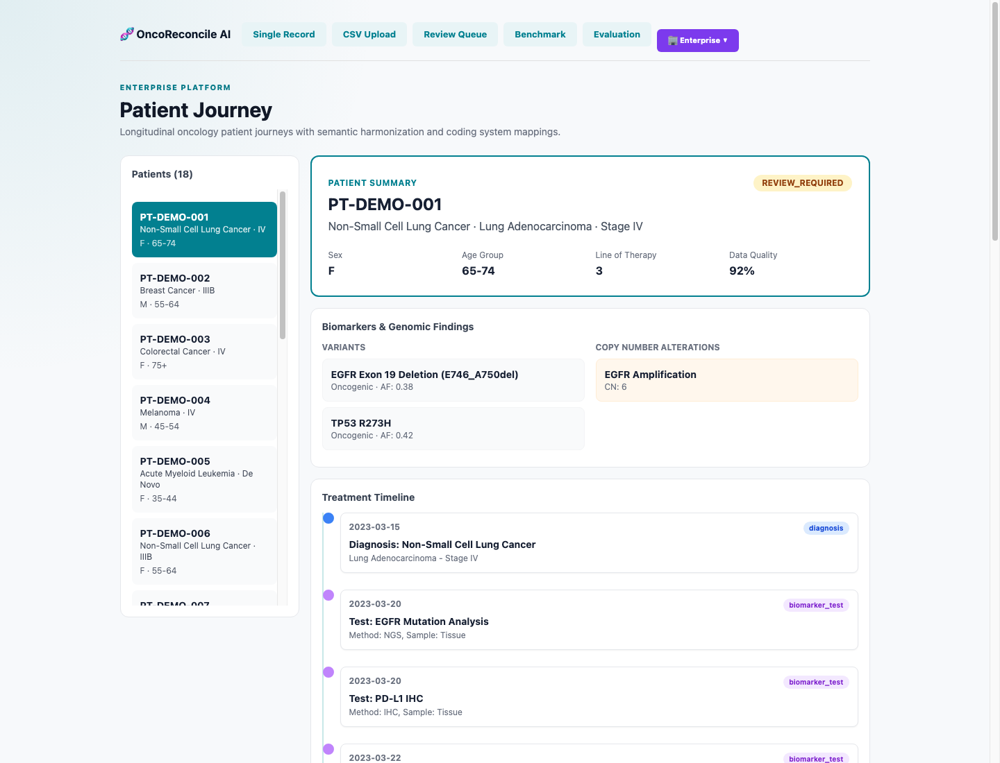
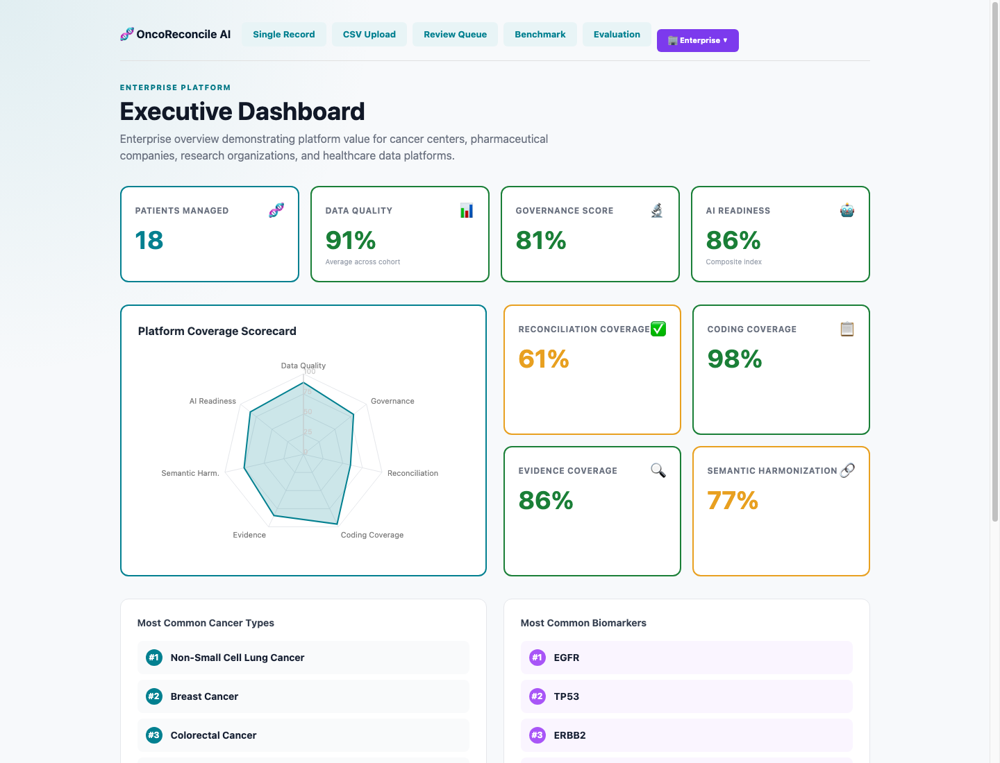
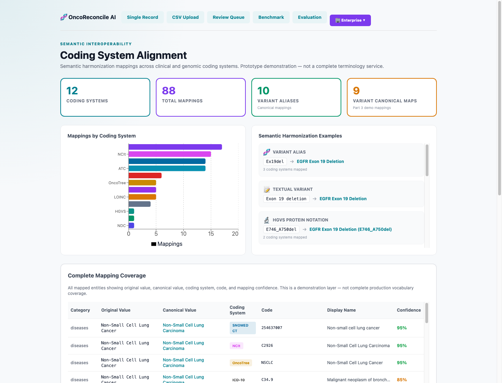

# OncoReconcile AI

## AI-Powered Precision Oncology Data Quality, Semantic Harmonization, Governance & Interoperability Platform

OncoReconcile AI is an AI-powered precision oncology data quality, semantic harmonization, governance, patient journey analytics, coding-system alignment, interoperability, and AI-ready biomedical data platform.

Built for the **DFWIT AI & Startup Competition 2026** by **Team Variant Vanguard**.

## Final Submission Branch

https://github.com/oncoreconcile-ai/oncoreconcile-ai/tree/enterprise-patient-journey-demo

## Quick Start

Prerequisites: Python 3.10+ and Node.js/npm.

### 1. Clone the repository

```bash
git clone https://github.com/oncoreconcile-ai/oncoreconcile-ai.git
cd oncoreconcile-ai
git checkout enterprise-patient-journey-demo
```

### 2. Set up the backend

```bash
cd backend
python3 -m venv .venv
source .venv/bin/activate
pip install -r requirements.txt
python -m uvicorn app.main:app --host 127.0.0.1 --port 8000
```

Backend API:

- http://127.0.0.1:8000
- http://127.0.0.1:8000/docs

### 3. Set up the frontend

Open a second terminal from the repository root:

```bash
cd frontend
npm install
npm run dev -- --host 127.0.0.1 --port 5173
```

Frontend app:

- http://127.0.0.1:5173

### 4. Run validation checks

From the repository root:

```bash
cd backend
source .venv/bin/activate
pytest -q tests
```

```bash
cd frontend
npm run build
```

## Key Capabilities

- Disease reconciliation
- Gene reconciliation
- Variant reconciliation
- Semantic harmonization
- Coding-system alignment
- Retrieval-augmented evidence workflows
- Human-governed review
- Patient journey analytics
- Executive analytics dashboard
- Benchmark evaluation
- FHIR R4 export prototype
- OMOP CDM export prototype
- Knowledge graph export
- API-first architecture

## Why This Matters

Precision oncology data is fragmented across:

- electronic health records;
- molecular diagnostic laboratories;
- clinical trials and research databases;
- claims and real-world-evidence platforms;
- registries, data warehouses, and external data partners.

The same biological or clinical concept often appears under different names:

| Input | Canonical representation |
|---|---|
| `HER2` | `ERBB2` |
| `HER1` | `EGFR` |
| `p53` | `TP53` |
| `NSCLC` | Lung Non-Small Cell Carcinoma |
| `Ex19del` | EGFR Exon 19 Deletion |

**A real example:** one laboratory reports `HER2`, another reports `HER-2`, a third reports `ERBB2`, and a claims system records `V-erb-b2`. A researcher trying to identify all ERBB2-altered patients must manually reconcile these representations — every time, for every project.

Poorly harmonized data increases manual effort, fragments cohorts, weakens interoperability, and reduces confidence in downstream analytics and AI.

OncoReconcile AI provides a governed data-quality layer that preserves uncertainty, exposes evidence, and routes ambiguous cases to human review.

## Competitive Differentiation

| Capability | Manual Curation | Terminology Tools | Generic LLMs | **OncoReconcile AI** |
|---|---|---|---|---|
| Disease normalization | Manual | ✓ | Inconsistent | ✓ |
| Gene normalization | Manual | Partial | Inconsistent | ✓ |
| Variant normalization | Manual | Partial | Inconsistent | ✓ |
| Evidence retrieval | Manual search | ✗ | Hallucination risk | ✓ (guarded MyVariant, ClinVar, CIViC, and experimental ClinGen lookup) |
| Confidence scoring | Subjective | ✗ | ✗ | ✓ (6-signal numeric) |
| Human governance | ✗ | ✗ | ✗ | ✓ (queue, approve/reject, kappa) |
| Audit trail | ✗ | ✗ | Unreliable | ✓ (full chronological history) |
| FHIR / OMOP export | Manual mapping | ✗ | ✗ | ✓ (prototypes) |
| Safety testing (0% false auto-accept) | ✗ | ✗ | ✗ | ✓ (benchmark validated) |
| Enterprise analytics | ✗ | ✗ | ✗ | ✓ (patient journey, executive) |

**The key difference:** OncoReconcile AI combines all of these in a governed, oncology-specific platform — not a terminology tool, not a knowledgebase, not a generic AI.

## Target Customers

| Customer | Pain | Value |
|---|---|---|
| **Cancer Centers** | Fragmented biomarker data across EHR, lab, and registry | Harmonized patient data, governed review, AI-ready cohorts |
| **Molecular Dx Labs** | Variant naming inconsistencies across reporting systems | Standardized representation, evidence lookup, quality dashboards |
| **CROs** | Multi-site trial data with different terminology standards | Cross-site standardization, FHIR/OMOP-ready outputs |
| **Pharma** | RWE and biomarker programs need consistent data across partners | Cohort analytics, governed pipelines, reproducible mappings |
| **Genomic KBs** | Curating evidence from heterogeneous sources | Normalized inputs, governed review, audit-ready curation |
| **Healthcare AI** | AI models depend on trustworthy terminology | Provenance-tracked data with explicit uncertainty |

## Business Model

| Revenue stream | Description |
|---|---|
| **Professional Services** | Oncology harmonization, FHIR/OMOP support, governance design |
| **SaaS — Team** | Shared review queues, batch reconciliation, dashboards |
| **SaaS — Enterprise** | Multi-user governance, role-based access, APIs, custom deployment |
| **Enterprise APIs** | Reconciliation, evidence, governance, and export APIs |

## Platform Modules

### Reconciliation and Semantic Harmonization

- Single-record reconciliation
- Batch and CSV reconciliation
- Disease, gene, and variant normalization
- Canonical HGVS resolution
- Semantic and coding-system mappings
- Transparent confidence scoring

### Evidence Intelligence

- Curated local evidence packages
- ClinVar evidence retrieval
- CIViC variant-record retrieval
- MyGene.info and MyVariant.info integrations
- Unified evidence display
- Source links, provenance, and retrieval-error reporting

### Human Governance

- `AUTO_RECONCILE`
- `REVIEW_REQUIRED`
- `CANNOT_RECONCILE`
- Review queue and reviewer workspace
- Approve, reject, edit, override, reopen, and adjudicate workflows
- Decision history, agreement metrics, notes, and audit trails

### Precision Oncology Analytics

- Synthetic longitudinal patient journeys
- Biomarker and cohort analytics
- Coding coverage and terminology analytics
- Data-quality and governance metrics
- Executive analytics dashboard

### Interoperability

- FHIR R4 export prototype
- OMOP CDM v5.4-oriented export prototype
- JSON-LD knowledge graph export
- Provenance export
- API-first integration through FastAPI

## Validation

| Metric | Final Submission result |
|---|---:|
| Backend Test Suite | 149 collected; 146 passing; 3 skipped |
| Frontend Build | Passing |
| Benchmark Framework | 500 Cases |
| Gene Accuracy | 96.6% |
| Variant Accuracy | 94.6% |
| Safety-Aware Status Accuracy | 89.8% |
| False Auto-Accept Rate | 0% |

These are internal engineering benchmark results, not clinical validation.

## Architecture Flow

```text
Clinical Data Sources
        ↓
Normalization
        ↓
Semantic Harmonization
        ↓
Evidence Retrieval
        ↓
Confidence Scoring
        ↓
Human Governance
        ↓
Patient Journey Analytics
        ↓
Executive Analytics
        ↓
FHIR / OMOP / Knowledge Graph Exports
```

## Evidence and API Architecture

The backend exposes FastAPI endpoints for reconciliation, evidence retrieval, human review, analytics, and standards-oriented exports.

Key endpoints include:

| Endpoint | Method | Purpose |
|---|---|---|
| `/reconcile` | POST | Reconcile one disease-gene-variant record |
| `/reconcile/batch` | POST | Reconcile multiple records |
| `/reconcile/upload` | POST | Reconcile a CSV upload |
| `/evidence/federated` | POST | Retrieve and unify configured evidence sources |
| `/hgvs/resolve` | POST | Resolve available protein, coding, and genomic HGVS values |
| `/review-queue` | GET | View governed review cases |
| `/benchmark` | GET | View benchmark evaluation metrics |
| `/export/fhir` | POST | Generate a FHIR R4 Bundle prototype |
| `/export/omop` | POST | Generate OMOP CDM-oriented records |
| `/export/knowledge-graph` | POST | Generate a JSON-LD knowledge graph |

The core workflow remains human governed. External evidence supports review and traceability; it does not provide diagnosis or treatment recommendations.

## Standards Alignment

OncoReconcile AI is designed around relevant healthcare interoperability, biomedical terminology, and precision oncology resources:

- HL7 FHIR
- OMOP Common Data Model
- SNOMED CT
- LOINC
- RxNorm
- ICD-10-CM
- HGNC
- ClinVar
- ClinGen
- NCI Thesaurus (NCIt)
- GA4GH Variant Representation Specification (VRS)
- CIViC
- MyGene.info
- MyVariant.info

Current implementation includes selected prototype mappings and standards-aligned exports. Additional terminology coverage remains future roadmap work. The project does not claim full production vocabulary coverage or formal standards compliance.

## Screenshots

### Platform Homepage


### Single-Record Reconciliation


### Review-Required Decision


### Human Review Queue


### Evaluation Dashboard


### Knowledge Graph Export


### Interactive API Documentation


### Enterprise Patient Journey



### Executive Dashboard



### Coding System Alignment



## Final Submission Documentation

- [Final Submission](https://docs.google.com/document/d/1SbL5lo-suS56S8TtRIwaH1IyHVYw3yaIVhLhYaURaQI/edit?tab=t.0)
- [PDF-Ready Final Submission](https://docs.google.com/document/d/1SbL5lo-suS56S8TtRIwaH1IyHVYw3yaIVhLhYaURaQI/edit?tab=t.0)
- [Final Demo Script](docs/final_demo_script.md)
- [One-Page Pitch Summary](docs/final_pitch_summary.md)
- [Final Submission Checklist](docs/final_submission_checklist.md)
- [Architecture](docs/architecture.md)
- [Architecture Diagrams](docs/architecture_diagrams.md)
- [Commercial Strategy](docs/commercial_strategy.md)
- [Roadmap](docs/roadmap.md)

## Repository

**Final Submission Branch:**

https://github.com/oncoreconcile-ai/oncoreconcile-ai/tree/enterprise-patient-journey-demo

## Disclaimer

OncoReconcile AI is a biomedical data harmonization, governance, interoperability, and analytics platform.

This is not clinical decision support and does not provide diagnosis, treatment recommendations, or medical advice.

The patient journey demonstration uses synthetic data. FHIR, OMOP, terminology, and knowledge graph capabilities are prototypes that require implementation-specific validation before production use.
