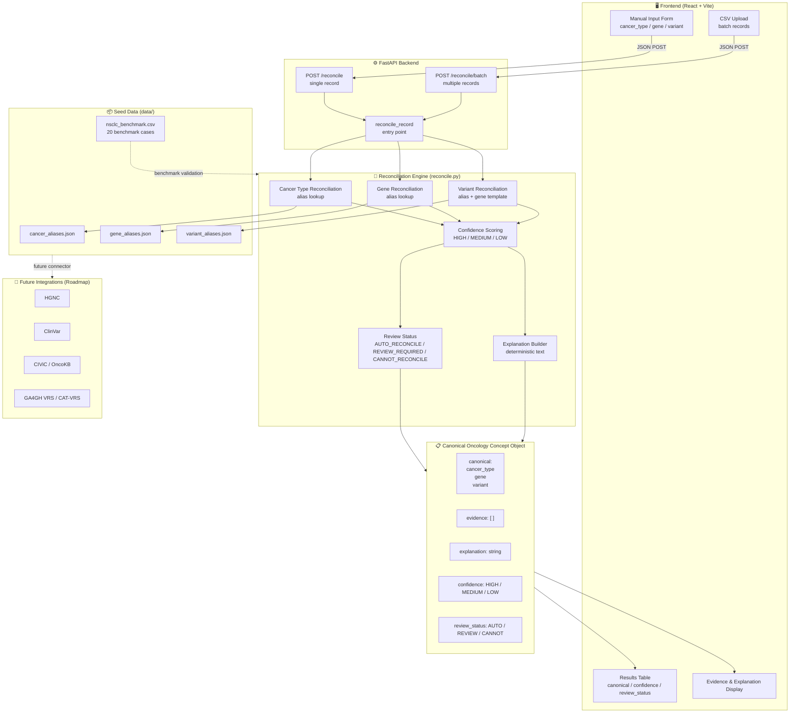

# Architecture

## High-Level Architecture



---

## Backend Components

| Component | Purpose |
|---|---|
| `main.py` | FastAPI app and endpoints |
| `models.py` | Pydantic request/response models |
| `reconcile.py` | Reconciliation engine |
| `evidence.py` | Evidence generation |
| `explain.py` | Explanation generation |
| `rules.py` | Confidence and review rules |

---

## Data Sources for MVP

The MVP starts with local seed dictionaries:

- `data/cancer_aliases.json`
- `data/gene_aliases.json`
- `data/variant_aliases.json`

Future versions can connect to:

- HGNC
- ClinVar
- CIViC
- VICC
- OncoKB if allowed
- GA4GH standards-based services

---

## API Contract

All frontend and backend work should follow:

```text
contracts/api_contract.md
```

Do not change the API contract without team discussion.

---

## Canonical Oncology Concept Object

The internal object should contain:

```json
{
  "canonical": {
    "cancer_type": "",
    "gene": "",
    "variant": ""
  },
  "evidence": [],
  "explanation": "",
  "confidence": "",
  "review_status": ""
}
```

This simplified object may later be mapped to GA4GH VRS or CAT-VRS-compatible structures.
