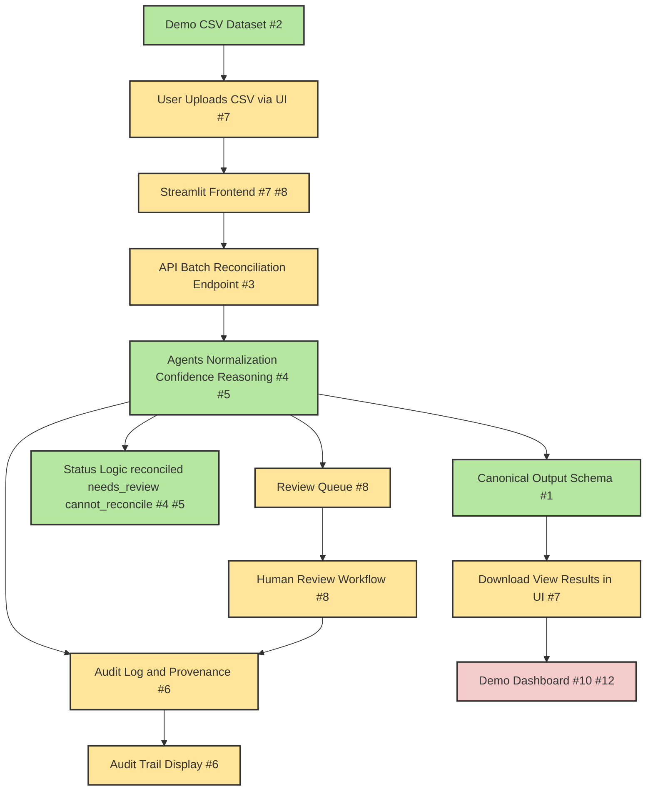

# OncoReconcile AI MVP Overview

## 1. MVP System Diagram

Below is a high-level diagram of the MVP, showing the true status of each feature:

## 1a. Issues That Can Be Started Without Blockers

The following issues can be started immediately (no dependencies):

- **#1: Define canonical reconciliation output schema**
- **#2: Create curated demo CSV dataset**
- **#4: Add explicit reconciliation status logic**
- **#9: Add API documentation and local runbook**
- **#11: Prepare pitch deck outline**

Once #1 and #2 are done, #3 (batch endpoint) can begin. See the main meeting agenda for a full dependency table.

- **Green:** Complete or MVP-ready (current week)
- **Yellow:** Partial/in progress (needs work for full MVP)
- **Orange:** Next week
- **Red:** Future/blocked (post-MVP or dependent)

- **Green:** Complete or MVP-ready (current week)
- **Yellow:** In progress or next week
- **Red:** Future/blocked (post-MVP or dependent)

## 2. Feature Status Details

| Feature                                 | Status    | Details | Issue(s) |
|------------------------------------------|-----------|---------|----------|
| User Uploads CSV via UI                  | Partial   | Only single variant input via text; CSV upload not yet implemented | #7 |
| Streamlit Frontend                       | Ready     | All main UI pages present; single variant input, review queue, audit log | #7, #8 |
| API: Batch Reconciliation Endpoint       | Partial   | Only single variant per request; batch endpoint not yet implemented | #3 |
| Agents: Normalization, Confidence, Reasoning | Ready | Full pipeline for single variant; multi-agent orchestration | #4, #5 |
| Canonical Output Schema                  | Ready     | Pydantic models in place for all outputs | #1 |
| Status Logic                             | Ready     | Status set by workflow/confidence agent | #4, #5 |
| Download/View Results in UI              | Partial   | Results shown in UI; no explicit download button | #7 |
| Audit Log & Provenance                   | Next      | Audit log and provenance tracking planned | #6 |
| Review Queue                             | Next      | Review queue backend and UI planned | #8 |
| Human Review Workflow                    | Next      | Human review workflow planned | #8 |
| Audit Trail Display                      | Next      | Audit trail display in UI planned | #6 |
| Demo Dashboard                           | Future    | Dashboard/summary views, test cases | #10, #12 |

## 3. What’s Next (Next Week)
- Audit log and provenance tracking
- Review queue (backend and UI)
- Human review workflow
- Audit trail display in UI
- More demo/test cases

## 4. What’s After (Future)
- Demo dashboard/summary views
- Advanced review/curation features
- Additional data integrations
- Stretch goals (see proposal)

---

**See also:**
- [Issue-to-File Mapping](../meetings/first_team_meeting_agenda.md#issue-to-file-mapping--where-to-start)
- [Architecture and Task Map](task_mapped_architecture.md)
- [Weekly Execution Plan](../project_plan/weekly_execution_plan.md)

---

*This diagram and summary help the team see what’s built, what’s next, and how new issues fit into the overall MVP.*
