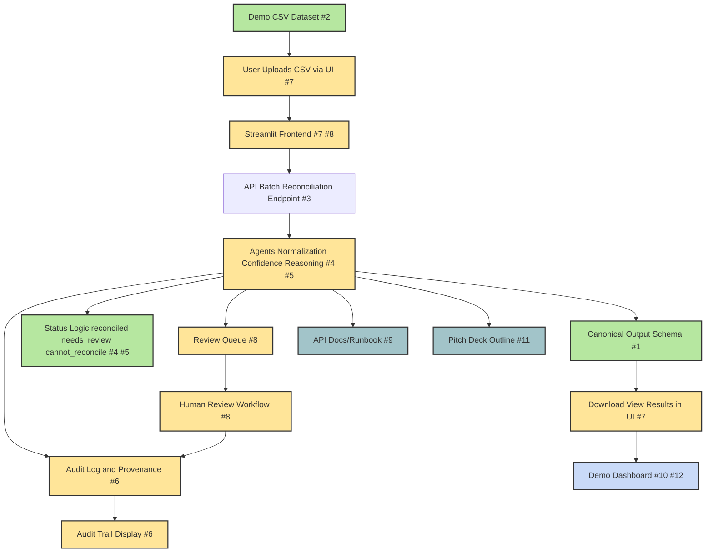

<!-- Color Legend for Diagram -->
**Diagram Color Legend:**

- Green = Complete/Done
- Light Blue = Ready to Develop (unblocked, not started)
- Yellow = In Progress/Partial/Next
- Red = Future/Blocked
- Blue = Documentation/Deliverable

*Note: GitHub may not render HTML color swatches, but the color codes match the diagram classes: `done`, `ready`, `partial`, `inprogress`, `next`, `future`, `doc`.*
## Parallel Development for Blocked Issues

To maximize team productivity, blocked issues can be developed in parallel using the following approach:

- **Create a feature branch** for each blocked issue.
- **Use mocks, stubs, or placeholder data** for any dependencies that are not yet implemented (e.g., API endpoints, schemas, or data files).
- **Coordinate interface contracts** (API schemas, function signatures, expected outputs) with the owners of blocking issues to minimize merge conflicts.
- **Write tests and documentation** as you go, using the mocked/stubbed interfaces.
- **Communicate regularly** with the team about progress and any changes to interfaces.
- **As soon as blockers are resolved:**
    - Rebase your feature branch onto the latest main/development branch.
    - Replace mocks/stubs with real implementations.
    - Run integration tests and resolve any conflicts.
    - Open a PR for review and merge.

**Example:**

- For #3 (Batch endpoint): Scaffold the endpoint and write tests using dummy data. After #1 and #2 are merged, update to use the real schema/data and integrate.
- For #7 (Upload/results UI): Build the UI with placeholder logic. After #3 is merged, connect to the real batch endpoint and test end-to-end.
- For #5, #6, #8, #10, #12: Follow the same pattern—develop logic, UI, or docs in isolation, then plug in and test as soon as dependencies are cleared.

This approach ensures all developers can contribute productively, and features can be integrated rapidly as soon as blockers are resolved.
# OncoReconcile AI MVP Overview

## 1. MVP System Diagram

Below is a high-level diagram of the MVP, showing the true status of each feature:

## 1a. Issues That Can Be Started Without Blockers

The following issues can be started immediately (no dependencies):

- **#9: Add API documentation and local runbook**
- **#11: Prepare pitch deck outline**

**Note:**
- #1 (Canonical output schema), #2 (Demo CSV dataset), and #4 (Status logic) are now complete and open for team review. See the feature status table above.

Once #1, #2, and #4 were completed, #3 (batch endpoint) became unblocked. See the main meeting agenda for a full dependency table.

- **Green:** Complete or MVP-ready (current week)
- **Yellow:** Partial/in progress (needs work for full MVP)
- **Orange:** Next week
- **Red:** Future/blocked (post-MVP or dependent)

- **Green:** Complete or MVP-ready (current week)
- **Yellow:** In progress or next week
- **Red:** Future/blocked (post-MVP or dependent)

## 2. Feature Status Details

| Feature                                 | Status    | Details | Issue(s) | Blocker(s) | Plug-in Point |
|------------------------------------------|-----------|---------|----------|------------|---------------|
| User Uploads CSV via UI                  | In Progress | UI wireframes and stubs in place; CSV upload logic to be implemented after batch endpoint | #7 | #3 | After #3 merged, connect UI to batch endpoint |
| Streamlit Frontend                       | Ready     | All main UI pages present; single variant input, review queue, audit log | #7, #8 |  |  |
| API: Batch Reconciliation Endpoint       | In Progress | Blockers #1 and #2 resolved; batch endpoint can now be implemented and integrated with canonical schema and demo CSV | #3 |  | Proceed with implementation and update tests |
| Agents: Normalization, Confidence, Reasoning | Ready | Full pipeline for single variant; multi-agent orchestration | #4, #5 |  |  |
| Canonical Output Schema                  | Complete  | Pydantic models in place for all outputs. Feature implemented and MVP-ready. Team review welcome. | #1 |  |  |
| Demo CSV Dataset                         | Complete  | Curated demo CSVs in place. Feature implemented and MVP-ready. Team review welcome. | #2 |  |  |
| Status Logic                             | Complete  | Status set by workflow/confidence agent. Feature implemented and MVP-ready. Team review welcome. | #4, #5 |  |  |
| Download/View Results in UI              | In Progress | Results shown in UI; download button to be added after batch endpoint | #7 | #3 | After #3 merged, connect UI to batch endpoint |
| Audit Log & Provenance                   | Ready to Develop   | Audit log and provenance tracking can proceed; blockers #1 and #4 are complete | #6 |  | Update schema and integrate |
| Review Queue                             | Ready to Develop   | Review queue backend and UI can proceed; blockers #4 and #6 are now ready or in progress | #8 |  | Connect UI/backend and test |
| Human Review Workflow                    | Ready to Develop   | Human review workflow can proceed; blockers #4 and #6 are now ready or in progress | #8 |  | Connect UI/backend and test |
| Audit Trail Display                      | Ready to Develop   | Audit trail display in UI can proceed; blockers #1 and #4 are complete | #6 |  | Update schema and integrate |
| Demo Dashboard                           | Ready to Develop   | Dashboard/summary views, test cases; blockers #2, #3, #7 are in progress or complete | #10, #12 |  | Finalize dashboard after #2, #3, #7 |

## 3. What’s Next (Next Week)
- Audit log and provenance tracking
- Review queue (backend and UI)
- Human review workflow
- Audit trail display in UI
- More demo/test cases

## 4. What’s After (Future)
- Demo dashboard/summary views
- Advanced review/curation features
- Additional data integrations
- Stretch goals (see proposal)

---

**See also:**
- [Issue-to-File Mapping](../meetings/first_team_meeting_agenda.md#issue-to-file-mapping--where-to-start)
- [Architecture and Task Map](task_mapped_architecture.md)
- [Weekly Execution Plan](../project_plan/weekly_execution_plan.md)

---

*This diagram and summary help the team see what’s built, what’s next, and how new issues fit into the overall MVP.*
