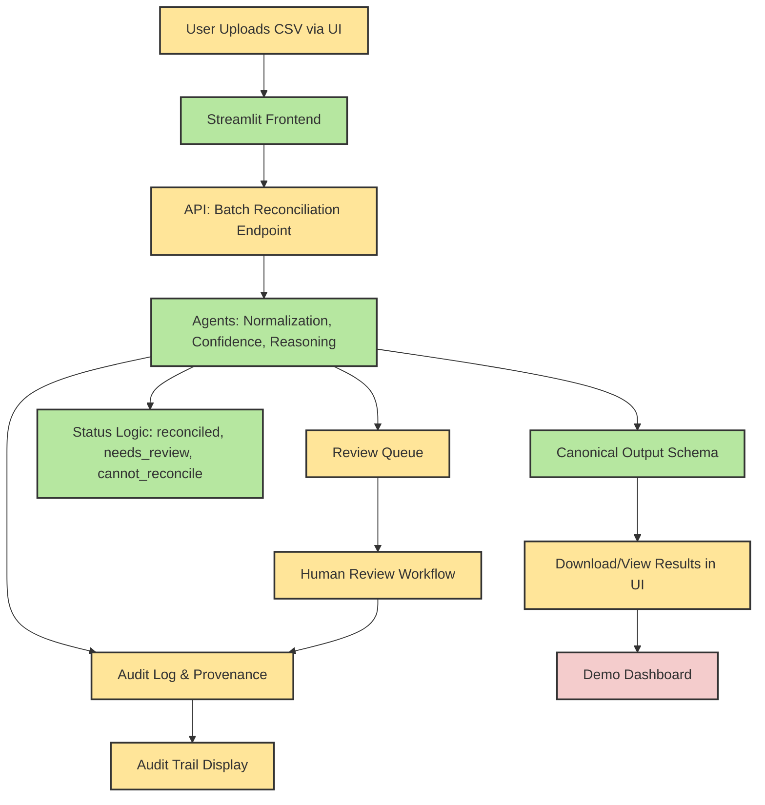

# OncoReconcile AI MVP Overview

## 1. MVP System Diagram

Below is a high-level diagram of the MVP, showing the true status of each feature:

- **Green:** Complete or MVP-ready (current week)
- **Yellow:** Partial/in progress (needs work for full MVP)
- **Orange:** Next week
- **Red:** Future/blocked (post-MVP or dependent)

- **Green:** Complete or MVP-ready (current week)
- **Yellow:** In progress or next week
- **Red:** Future/blocked (post-MVP or dependent)

## 2. Feature Status Details

| Feature                                 | Status    | Details |
|------------------------------------------|-----------|---------|
| User Uploads CSV via UI                  | Partial   | Only single variant input via text; CSV upload not yet implemented |
| Streamlit Frontend                       | Ready     | All main UI pages present; single variant input, review queue, audit log |
| API: Batch Reconciliation Endpoint       | Partial   | Only single variant per request; batch endpoint not yet implemented |
| Agents: Normalization, Confidence, Reasoning | Ready | Full pipeline for single variant; multi-agent orchestration |
| Canonical Output Schema                  | Ready     | Pydantic models in place for all outputs |
| Status Logic                             | Ready     | Status set by workflow/confidence agent |
| Download/View Results in UI              | Partial   | Results shown in UI; no explicit download button |

## 3. What’s Next (Next Week)
- Audit log and provenance tracking
- Review queue (backend and UI)
- Human review workflow
- Audit trail display in UI
- More demo/test cases

## 4. What’s After (Future)
- Demo dashboard/summary views
- Advanced review/curation features
- Additional data integrations
- Stretch goals (see proposal)

---

**See also:**
- [Issue-to-File Mapping](../meetings/first_team_meeting_agenda.md#issue-to-file-mapping--where-to-start)
- [Architecture and Task Map](task_mapped_architecture.md)
- [Weekly Execution Plan](../project_plan/weekly_execution_plan.md)

---

*This diagram and summary help the team see what’s built, what’s next, and how new issues fit into the overall MVP.*
