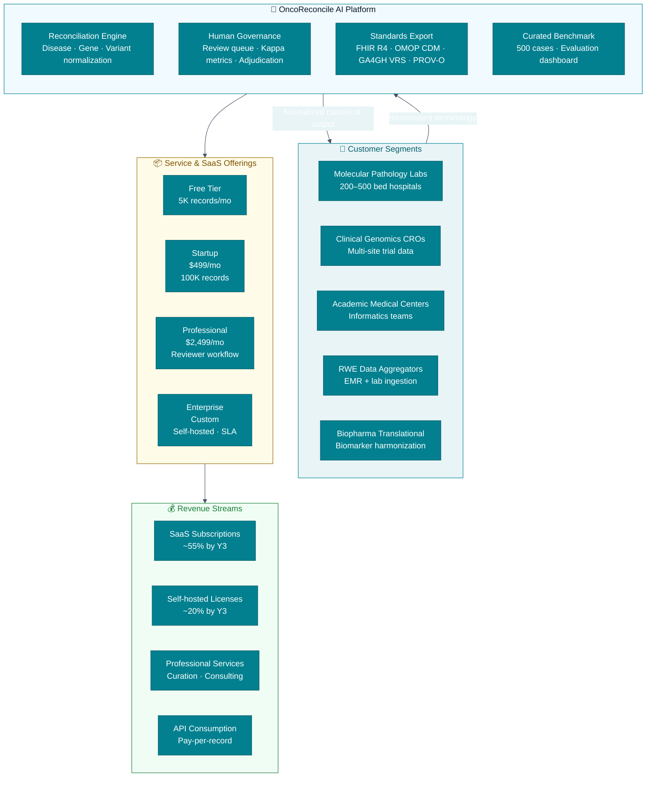

# OncoReconcile AI — Architecture Diagrams

**Author:** Engineering & Product
**Date:** June 20, 2026
**Status:** Production-quality diagrams for README, pitch deck, and DFW AI Competition

---

## Table of Contents

1. [Business Architecture Diagram](#1-business-architecture-diagram)
2. [Technical Architecture Diagram](#2-technical-architecture-diagram)
3. [Future Product Architecture Diagram](#3-future-product-architecture-diagram)
4. [Mermaid Source Code](#4-mermaid-source-code)
5. [draw.io Layout Recommendations](#5-drawio-layout-recommendations)

---

## 1. Business Architecture Diagram

This diagram shows the business context: who uses the product, what value streams are delivered, and how revenue flows.



**Key business flows:**
- Five customer segments feed inconsistent oncology terminology into the platform
- The platform normalizes, governs, and exports in standards-compatible format
- Four SaaS tiers monetize at different scales
- Revenue diversifies across subscriptions, licenses, services, and API consumption

---

## 2. Technical Architecture Diagram

This diagram shows the current system architecture — all implemented components and their relationships.

```mermaid
%%{init: {'theme': 'base', 'themeVariables': {'primaryColor': '#028090', 'primaryTextColor': '#fff', 'primaryBorderColor': '#075f6c', 'lineColor': '#475569', 'secondaryColor': '#e8f4f6', 'tertiaryColor': '#f7f9fb', 'fontFamily': 'Inter, sans-serif'}}}%%
flowchart TB
    %% ── External actors ──
    User(["🧑‍🔬 Curator / Analyst"])
    Developer(["👨‍💻 Developer / API Consumer"])

    %% ── Frontend ──
    subgraph Frontend["React Frontend (Vite)"]
        direction TB
        Single["Single Record\nReconciliation"]
        CSV["CSV Batch Upload"]
        Review["Review Queue\n· Approve / Reject / Edit\n· Reviewer assignment"]
        Evaluation["Evaluation Dashboard\n· Accuracy · Coverage\n· Failure breakdown\n· Reviewer agreement\n· Trend charts"]
        Standards["Standards Exports\n· FHIR R4 · OMOP\n· VRS · Cat-VRS\n· VA-Spec · PROV-O"]
    end

    %% ── API Gateway ──
    subgraph API["FastAPI Backend (Python 3.10)"]
        direction TB
        ReconcileEP["POST /reconcile\nPOST /reconcile/batch\nPOST /reconcile/upload"]
        GovernanceEP["GET /review-queue\nPOST /review-queue/{id}/decision\nPOST /review-queue/{id}/adjudicate"]
        ExportEP["POST /export/fhir\nPOST /export/omop\nPOST /export/provenance\nPOST /export/knowledge-graph\nPOST /export/vrs-ready\nPOST /export/cat-vrs-ready\nPOST /export/va-spec-ready"]
        BenchmarkEP["GET /benchmark\nGET /review-queue-metrics"]
    end

    %% ── Core Engine ──
    subgraph Engine["Reconciliation Engine (reconcile.py)"]
        direction TB
        Disease["Cancer Type Normalization\n· Alias dictionary\n· Fuzzy matching (RapidFuzz)\n· SNOMED CT mapping"]
        Gene["Gene Normalization\n· HGNC alias lookup\n· MyGene.info external API\n· Local catalog context\n· HGNC → OMOP concepts"]
        Variant["Variant Normalization\n· Catalog match\n· Synonym alias\n· Protein hotspot detection\n· CIViC / ClinGen external"]
        Confidence["Confidence Scoring\n· 6-signal weighted model\n· Score 0.0–1.0 → HIGH/MED/LOW\n· Score breakdown per signal"]
        Explain["Deterministic Explanation\n· Rule-based text generation\n· No LLM dependency for core path"]
        Status["Review Status Decision\n· AUTO_RECONCILE\n· REVIEW_REQUIRED\n· CANNOT_RECONCILE"]
        Ambiguity["Cat-VRS Ambiguity\n· NTRK categorical fusion\n· Candidate alternatives\n· Preserved for human review"]
    end

    %% ── External Integrations ──
    subgraph External["🔌 External Integrations"]
        direction LR
        MyVariant["MyVariant.info\nVariant annotation API"]
        ClinVar["ClinVar (NCBI)\nClinical significance"]
        CIViC["CIViC\nOncology evidence"]
        ClinGen["ClinGen Allele Registry\nAllele identification"]
        MyGene["MyGene.info\nGene alias resolution"]
    end

    %% ── Data Stores ──
    subgraph Data["📦 Data Layer"]
        direction TB
        Catalogs["Curated Catalogs\n· gene_aliases.json\n· cancer_aliases.json\n· variant_aliases.json\n· disease_gene_catalog.csv"]
        VariantCatalog["Gene-Variant Catalog\n· gene_variant_catalog.csv\n· CIViC candidates\n· External evidence map"]
        ReviewQueue["Review Queue\n· review_queue.json\n· Decision history\n· Adjudication records"]
        Benchmark["Benchmark & Evaluation\n· benchmark_cases.csv (191)\n· Evaluation metrics\n· Failure analysis"]
    end

    %% ── Export Layer ──
    subgraph Exports["📋 Standards Exports"]
        direction LR
        FHIR["FHIR R4 Bundle\n· Patient (placeholder)\n· Condition (SNOMED)\n· Observation (LOINC)\n· MolecularSequence\n· DiagnosticReport\n· Provenance"]
        OMOPExport["OMOP CDM v5.4\n· condition_occurrence\n· measurement\n· observation\n· Concept IDs 0–resolved\n· Source codes preserved"]
        Graph["Knowledge Graph\n· JSON-LD\n· PROV-O inspired\n· OncoReconcile ontology"]
        VRS["GA4GH Stubs\n· VRS-ready\n· Cat-VRS-ready\n· VA-Spec-ready"]
    end

    %% ── Flows ──
    User -->|Web UI| Frontend
    Developer -->|REST API| API
    Frontend -->|HTTP| API
    API --> ReconcileEP

    ReconcileEP --> Engine
    Engine --> Disease
    Engine --> Gene
    Engine --> Variant
    Engine --> Confidence
    Engine --> Explain
    Engine --> Status
    Engine --> Ambiguity

    Disease --> Catalogs
    Gene --> Catalogs
    Gene -->|External candidate| MyGene
    Variant --> VariantCatalog
    Variant -->|External candidate| External

    External --> MyVariant
    External --> ClinVar
    External --> CIViC
    External --> ClinGen

    Status -->|REVIEW_REQUIRED| GovernanceEP
    GovernanceEP --> ReviewQueue
    GovernanceEP --> User

    API --> ExportEP
    ExportEP --> Exports
    FHIR -->|download| User
    OMOPExport -->|download| User

    API --> BenchmarkEP
    BenchmarkEP --> Benchmark
    Benchmark --> Evaluation

    API --> ExportEP --> Graph

    %% ── styling ──
    style User fill:#e8f4f6,stroke:#028090,color:#075f6c
    style Developer fill:#e8f4f6,stroke:#028090,color:#075f6c
    style Frontend fill:#f0faff,stroke:#028090,color:#0A1628
    style API fill:#f0faff,stroke:#028090,color:#0A1628
    style Engine fill:#fefce8,stroke:#9a6700,color:#7d4e00
    style External fill:#fef2f2,stroke:#cf222e,color:#cf222e
    style Data fill:#f8fafc,stroke:#64748b,color:#334155
    style Exports fill:#f0fdf4,stroke:#1a7f37,color:#1a7f37
```



**Key technical flows:**
1. **Input → Normalize**: Raw disease/gene/variant strings enter via API or CSV upload
2. **Normalize → Match**: Deterministic alias lookup → fuzzy fallback → external API lookup
3. **Match → Score**: 6-signal confidence model produces 0.0–1.0 score + breakdown
4. **Score → Decide**: HIGH(≥0.75) auto-reconciles, MEDIUM routes to review, LOW cannot-reconcile
5. **Review → Govern**: Human reviewers approve/reject/edit, agreement measured by Cohen's kappa
6. **Export**: Any result can be exported as FHIR R4 Bundle, OMOP CDM records, JSON-LD knowledge graph, or GA4GH stubs

---

## 3. Future Product Architecture Diagram

This diagram shows the planned architecture including RAG assistant, FHIR subscription engine, cross-institution de-identification, and clinical trial matching.

```mermaid
%%{init: {'theme': 'base', 'themeVariables': {'primaryColor': '#028090', 'primaryTextColor': '#fff', 'primaryBorderColor': '#075f6c', 'lineColor': '#475569', 'secondaryColor': '#e8f4f6', 'tertiaryColor': '#f7f9fb', 'fontFamily': 'Inter, sans-serif'}}}%%
flowchart TB
    %% ── Existing components (implemented) ──
    subgraph Existing["✅ Implemented (MVP)"]
        direction TB
        Frontend["React Frontend\n· Reconciliation\n· Review Queue\n· CSV Upload\n· Evaluation Dashboard"]
        API["FastAPI Backend\n· REST endpoints\n· Auth (API keys)\n· Rate limiting"]
        Engine["Reconciliation Engine\n· Disease/Gene/Variant normalization\n· Confidence scoring\n· Evidence retrieval"]
        Gov["Governance Workflow\n· Review queue\n· Kappa metrics\n· Adjudication"]
        FHIR["FHIR R4 Export\n· Condition · Observation\n· MolecularSequence\n· Provenance · DiagnosticReport"]
        OMOP["OMOP CDM v5.4 Export\n· condition_occurrence\n· measurement · observation"]
        KG["Knowledge Graph Export\n· JSON-LD · PROV-O"]
    end

    %% ── 30-day additions ──
    subgraph Month1["📅 30-Day (In Progress)"]
        direction TB
        MultiTenant["Multi-Tenant SaaS\n· Tenant isolation\n· Usage tracking"]
        Billing["Billing & Auth\n· Stripe integration\n· Tier-based gating"]
    end

    %% ── 90-day additions ──
    subgraph Month3["📅 90-Day (Planned)"]
        direction TB
        Copilot["Reviewer Copilot\n· ML-suggested decisions\n· Similar-case precedent\n· Conflict-of-interest flagging"]
        Audit["Advanced Audit\n· Immutable event store\n· FDA 21 CFR Part 11\n· Bulk review actions"]
    end

    %% ── 12-month additions ──
    subgraph Month12["📅 12-Month (Future)"]
        direction TB
        RAG["🧠 RAG Assistant\n· Vector-embedded knowledge base\n· Context-aware variant lookup\n· Literature evidence synthesis"]
        FHIRSub["Real-time FHIR Subscription\n· Subscribe to EHR FHIR server\n· Auto-normalize incoming records"]
        DeID["Cross-Institution De-identification\n· HIPAA-compliant\n· Multi-site cohort assembly"]
        TrialMatch["Clinical Trial Matching\n· Normalize patient vs eligibility\n· ClinicalTrials.gov integration"]
        CatalogMarket["Curated Catalog Marketplace\n· NSCLC catalog · CLL catalog\n· Pediatric oncology catalog"]
        MultiLang["Multi-Language Support\n· Chinese · Japanese · Korean\n· Oncology term normalization"]
        NLP["Oncology NLP Pipeline\n· Unstructured pathology reports\n· Extract disease/gene/variant"]
        Compliance["Full GA4GH VRS Compliance\n· VRS 2.0 allele/haplotype\n· Pass GA4GH test suite"]
        Epic["EHR-native Integration\n· Epic App Orchard\n· Cerner integration"]
        RegPath["Regulatory Pathway\n· 510(k) · CLIA · CE-IVDR"]
    end

    %% ── Data Growth ──
    subgraph Data["📦 Data Layer Evolution"]
        direction TB
        CurrentData["Current (File-based)\n· JSON + CSV files\n· File-backed review queue"]
        FutureData["Future (Database)\n· PostgreSQL + TimescaleDB\n· Vector DB (pgvector)\n· Event store for audit"]
    end

    %% ── Connections ──
    Frontend --> API
    API --> Engine
    API --> Gov
    API --> FHIR
    API --> OMOP
    API --> KG

    Engine -->|Future RAG context| RAG
    RAG -->|Evidence synthesis| Engine
    RAG -->|Literature grounding| Gov

    FHIRSub -->|Auto-consume| FHIR
    FHIRSub -->|Subscribe| Epic

    TrialMatch -->|Normalize| Engine
    TrialMatch -->|Protocol matching| FHIR

    NLP -->|Extracted entities| Engine

    CurrentData -->|Migration| FutureData
    FutureData -->|Vector storage| RAG
    FutureData -->|Immutability| Audit

    Copilot -->|ML suggestions| Gov
    Audit -->|Compliance trail| Gov

    classDef existing fill:#f0fdf4,stroke:#1a7f37,color:#1a7f37
    classDef month1 fill:#e8f4f6,stroke:#028090,color:#075f6c
    classDef month3 fill:#fefce8,stroke:#9a6700,color:#7d4e00
    classDef month12 fill:#fef2f2,stroke:#cf222e,color:#cf222e
    classDef data fill:#f8fafc,stroke:#64748b,color:#334155

    class Existing existing
    class Month1 month1
    class Month3 month3
    class Month12 month12
    class Data data
```



**Architecture evolution:**
- **Green** (implemented): Core reconciliation, governance, FHIR/OMOP/KG exports
- **Teal** (month 1): SaaS multi-tenancy and billing make the product commercially deployable
- **Amber** (month 3): ML-powered reviewer copilot and regulatory-grade audit trail
- **Red** (month 12): RAG assistant for evidence-grounded recommendations, FHIR subscription engine for EHR auto-normalization, clinical trial matching, cross-institution de-identification, NLP pipeline for unstructured pathology reports, and full GA4GH VRS compliance

---

## 4. Mermaid Source Code

All three diagrams above render in any Mermaid-compatible Markdown viewer (GitHub, GitLab, Notion, Mermaid Live Editor).

### Quick Reference

| Diagram | Source Location | Usage |
|---|---|---|
| Business Architecture | `docs/architecture_diagrams.md` — Section 1 | GitHub README, investor deck, DFW competition |
| Technical Architecture | `docs/architecture_diagrams.md` — Section 2 | Technical docs, onboarding, architecture review |
| Future Architecture | `docs/architecture_diagrams.md` — Section 3 | Roadmap presentations, strategic planning |

### To render standalone:

1. Copy any Mermaid block into the **[Mermaid Live Editor](https://mermaid.live)**
2. Export as SVG or PNG for pitch decks
3. For GitHub: the raw `.md` file renders automatically

---

## 5. draw.io Layout Recommendations

For producing high-resolution, polished diagrams suitable for startup pitch decks and competition submissions, use **[draw.io](https://app.diagrams.net)** (free, no account required).

### Recommended Approach

#### Technique: Manual Layout with draw.io

Draw.io is preferred over automated mermaid→draw.io converters because it gives you full control over layout, typography, and visual hierarchy.

For each diagram, use the following settings:

| Setting | Value |
|---|---|
| **Canvas size** | 1920×1080 (16:9 widescreen) |
| **Background** | White (#FFFFFF) or Off-white (#F7F9FB) |
| **Font** | Inter, 11pt (download from Google Fonts) |
| **Grid** | 10px grid, snap to grid on |
| **Page view** | 100% zoom |

#### Color Palette

| Purpose | Hex | Used For |
|---|---|---|
| Primary teal | `#028090` | Header boxes, primary flow arrows |
| Success green | `#1A7F37` | Export layer, auto-reconcile, "Existing" blocks |
| Warning amber | `#9A6700` | Review layer, "Planned (90-day)" blocks |
| Danger red | `#CF222E` | External APIs, "Future (12-month)" blocks |
| Info blue | `#0969DA` | Database layer, integrations |
| Surface | `#F7F9FB` | Canvas background |
| Card | `#FFFFFF` | Component backgrounds |
| Border | `#D0D7DE` | Card borders |
| Text | `#172033` | Body text |
| Text subdued | `#667085` | Labels, secondary text |

#### Icon Set

Use clear, recognizable icons from the built-in draw.io icon library or import custom SVGs:

| Component | Icon |
|---|---|
| User / Curator | Person silhouette |
| Developer | Code bracket / Terminal |
| Frontend | Monitor / Browser window |
| Backend API | Gear / Cloud |
| Database | Cylinder |
| External API | Cloud with arrow |
| FHIR / OMOP | Document with letters |
| Review / Governance | Clipboard with checkmark |
| Engine / Reconcile | DNA helix / Microscope |
| RAG / AI | Brain / Sparkle |

#### Layout Rules

1. **Left-to-right flow**: External inputs → Left side, Platform → Center, Exports → Right side
2. **Top-to-bottom hierarchy**: Users → top, API layer → middle, Data stores → bottom
3. **Sub-diagrams**: Group related components inside rounded rectangles (use draw.io "Container" shape)
4. **Arrows**: Only use orthogonal (right-angle) connectors, not curved
5. **Arrow labels**: Keep to 2–4 words, font 9pt, color `#475569`
6. **Spacing**: Minimum 20px between unrelated components, 10px inside sub-diagrams

#### Step-by-Step: Building the Technical Architecture Diagram in draw.io

1. **Create canvas**: File → New → Blank, set to 1920×1080
2. **Background**: Set fill to `#F7F9FB`
3. **Title**: Top-center, "OncoReconcile AI — Technical Architecture", 24pt bold, `#0A1628`
4. **Create sub-diagrams** (rounded rectangles with header bars):
   - "React Frontend" — top-left
   - "FastAPI Backend" — top-center
   - "Reconciliation Engine" — center
   - "External Integrations" — top-right
   - "Data Layer" — bottom-center
   - "Standards Exports" — bottom-right
5. **Add components** as rounded rectangles (6px radius) with white fill and 2px borders:
   - Use the color palette for border colors
   - Add text labels centered, 11pt
   - Add icons from the shape library
6. **Connect components** with orthogonal arrows:
   - Arrow color: `#475569`, 2px
   - Add small text labels at midpoints
7. **Export**: File → Export as → PNG (300 DPI for print, 150 DPI for web)

#### Export Settings for Pitch Decks

| Use Case | Format | DPI | Size |
|---|---|---|---|
| GitHub README | SVG (or PNG) | 72 DPI | Inline in markdown |
| Startup pitch deck | PNG | 300 DPI | Slide-fill, 1920×1080 |
| DFW AI Competition | PDF | 300 DPI | Letter or 16:9 |
| Technical documentation | SVG | N/A | Inline in docs |

### draw.io Template Files

For quick start, create these three draw.io files and share with the team:

```text
docs/diagrams/
├── business-architecture.drawio
├── technical-architecture.drawio
└── future-architecture.drawio
```

### Color-Coding Legend for All Diagrams

```
┌──────────────────────┐
│ 🟢 Implemented (MVP) │
│ ─────────────────── │
│ 🔵 30-Day (In Prog.) │
│ ─────────────────── │
│ 🟡 90-Day (Planned)  │
│ ─────────────────── │
│ 🔴 12-Month (Future) │
└──────────────────────┘
```

Include this legend on every multi-phase diagram for quick scanning.

---

*Version 1.0 — June 20, 2026*
