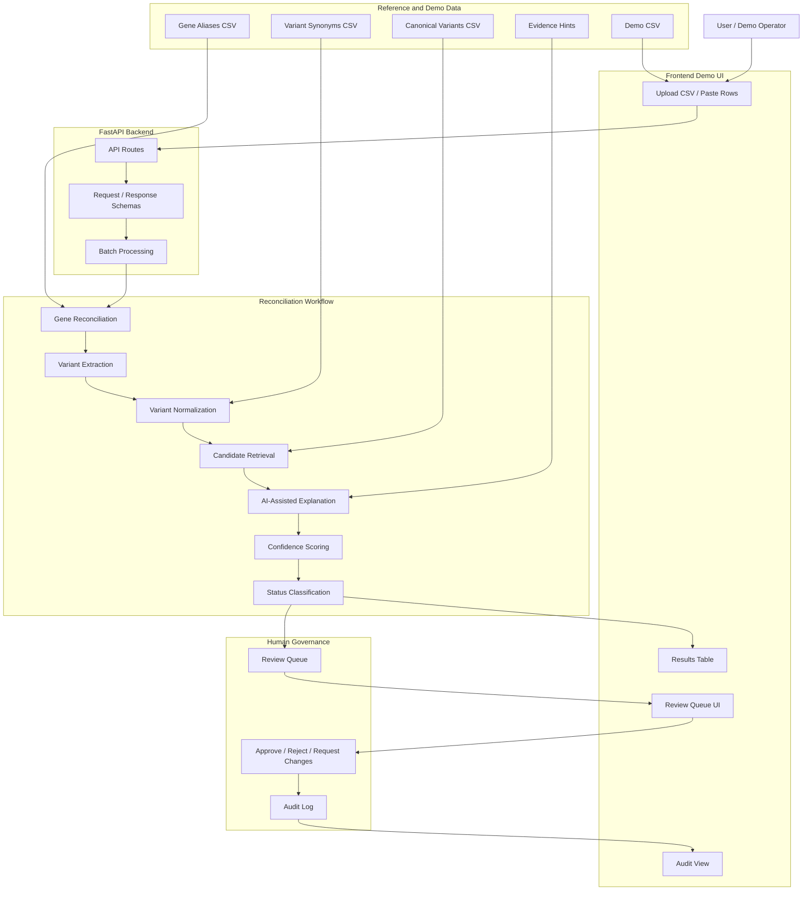
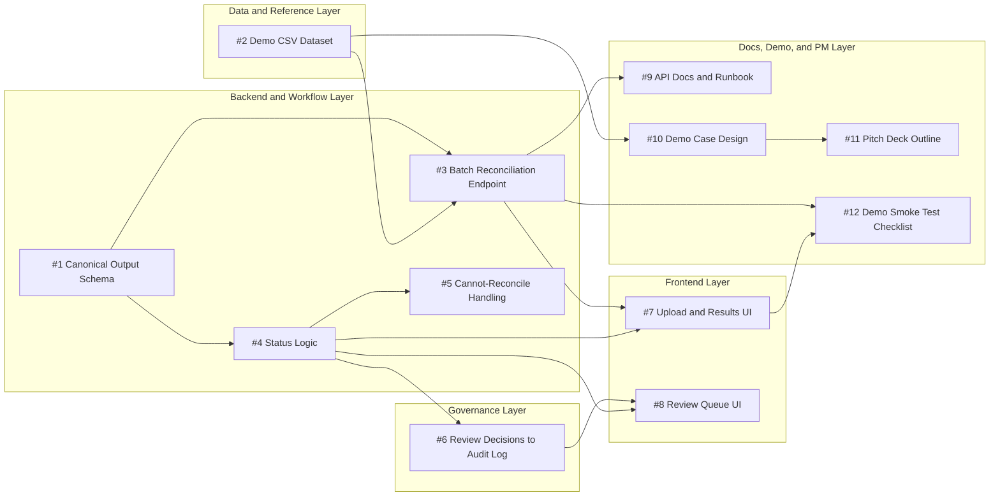
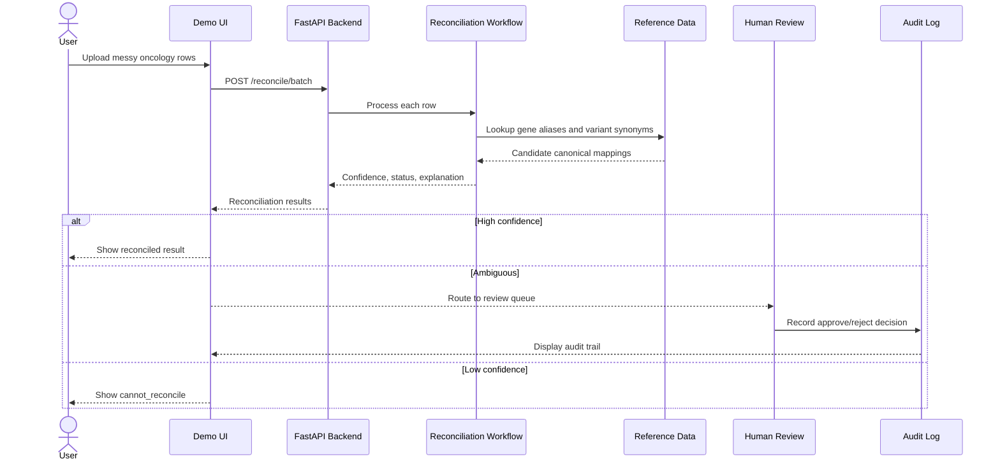
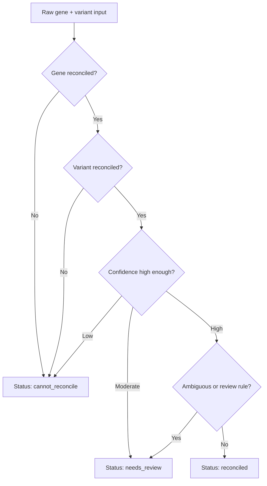

# Architecture and Task Map Diagrams

These diagrams visualize the OncoReconcile AI MVP architecture and show where each GitHub issue fits.

## MVP System Architecture

## Issue-to-Architecture Map

## Demo Story Flow

## Status Decision Concept

## How to Use These Diagrams

- Use the MVP System Architecture diagram to explain the overall project to new team members and judges.
- Use the Issue-to-Architecture Map to help team members pick tasks and understand dependencies.
- Use the Demo Story Flow to rehearse the final competition walkthrough.
- Use the Status Decision Concept to explain why uncertainty is preserved instead of forcing mappings.
